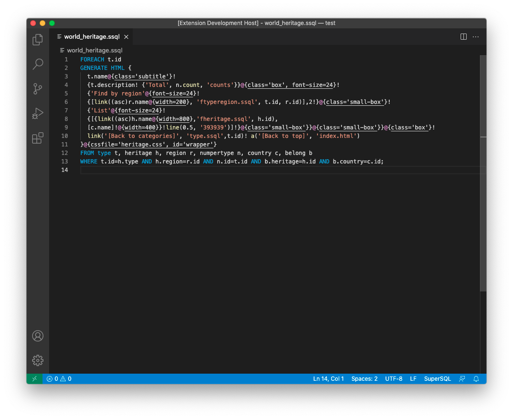
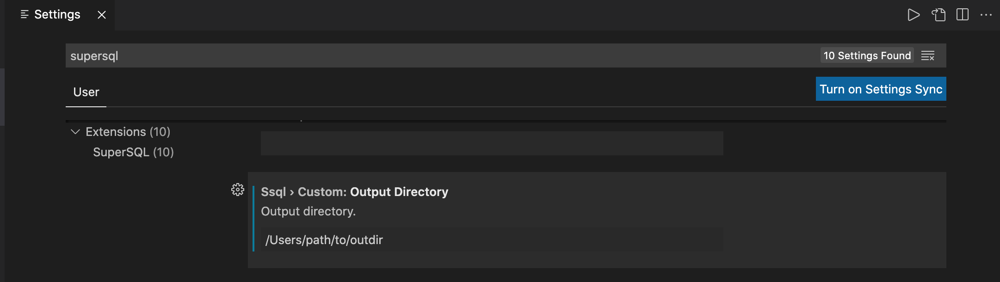

# SuperSQL Extension for Visual Studio Code

Welcome to SuperSQL Extension for Visual Studio Code. This is an extension for supporting to write SuperSQL queries. Currently the extension provides only syntax highlighting.

For more information of SuperSQL, visit [here](http://ssql.db.ics.keio.ac.jp/).

## Usage

1. Write a SuperSQL query and save it with `.ssql` (e.g., `yourfilename.ssql`)
2. Choose "SuperSQL: Execute SuperSQL" in command pallet or press Cmd+Shift+e (Mac) / Ctrl+Shift+e (Win)
3. Check the results in the preview window.

Once you have done, the execution and preview will automatically run on save.

## Notes

To use the preview function, make sure to set `config.custom.outputDirectory` in the VS Code extension settings even when the output directory is specified in .ssql file. If you set the different one in `config.custom.outputDirectory`, .ssql setting will be overwritten.

e.g.)
If you want to use the preview and get the output in `/Users/path/to/outdir`, configure outputDirectory as follows:

## Release Notes

See [this](CHANGELOG.md) change log.
